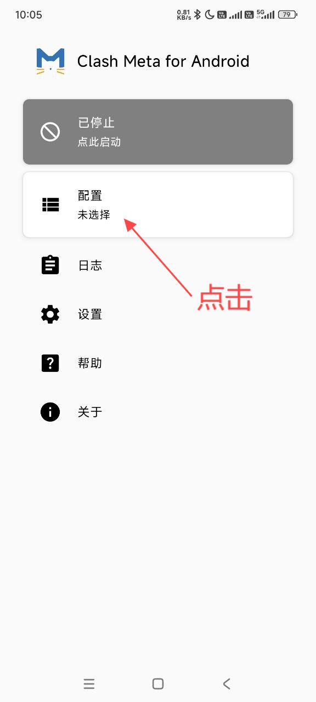
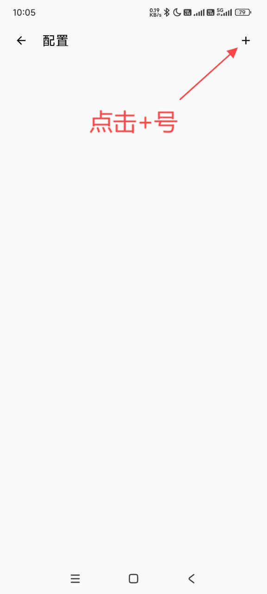
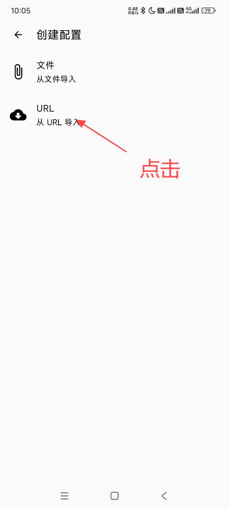
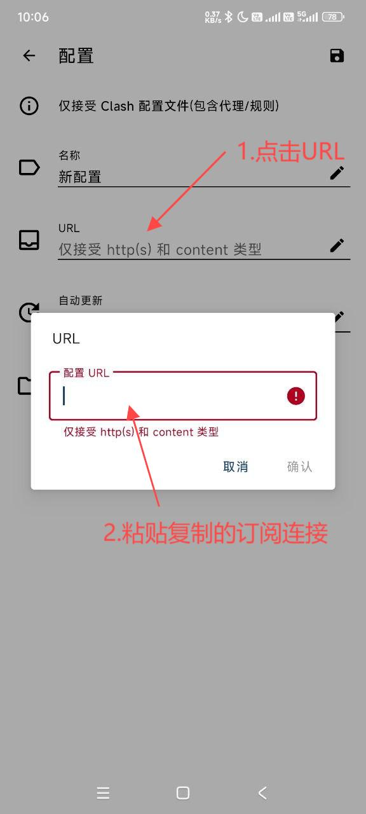
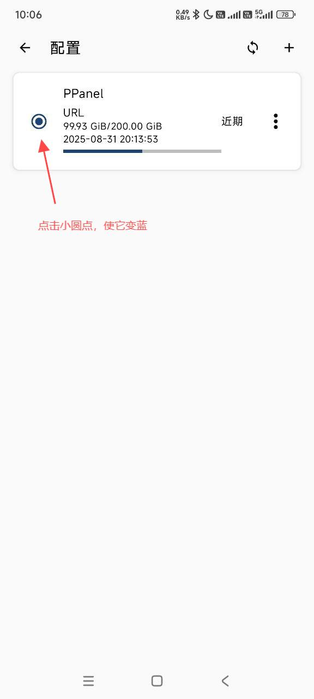
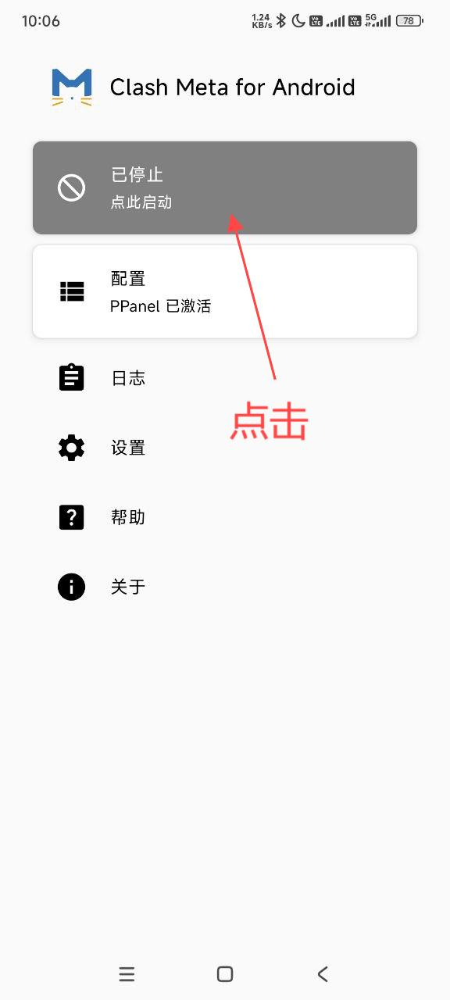
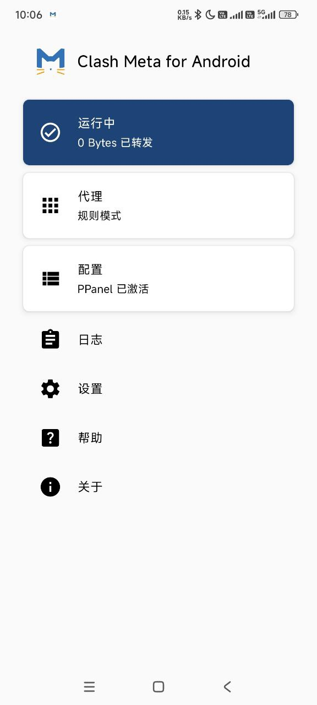

# Clash Meta for Android

[Clash Meta for Android](https://tagcloud.lanzouw.com/io2u02b85x8d)，是基于开源代理软件项目Clash Meta的安卓适配版本，功能强大且支持多种代理协议，如Shadowsocks(SS)、ShadowsocksR(SSR)、Socks、Snell、V2Ray、Trojan等代理协议。

---
**注意**：

- `系统要求：Android 7.0 及以上`
- `设备要求：Android Phone / Tablet`
---

### 使用教程：
##### 导入配置

---

最新更新于 2024.11.16
