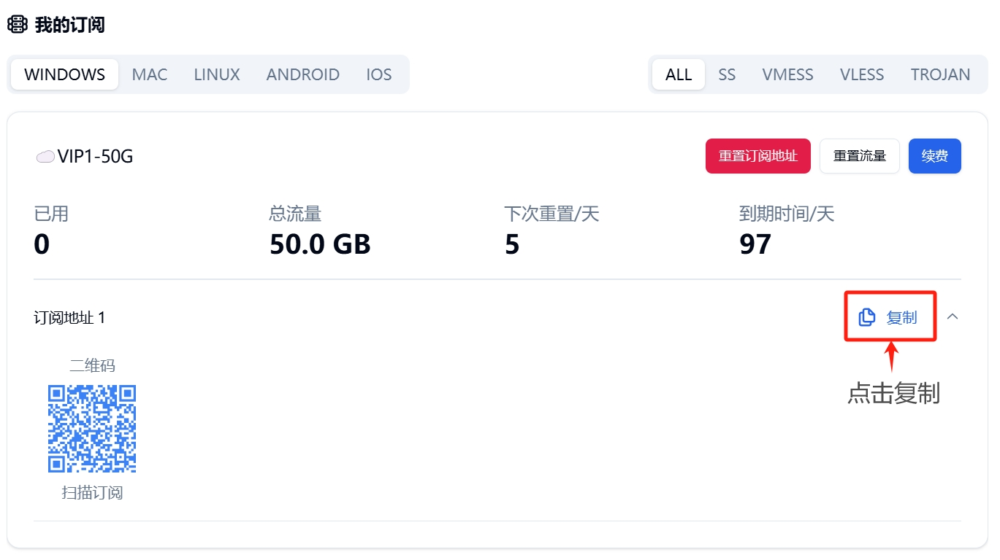
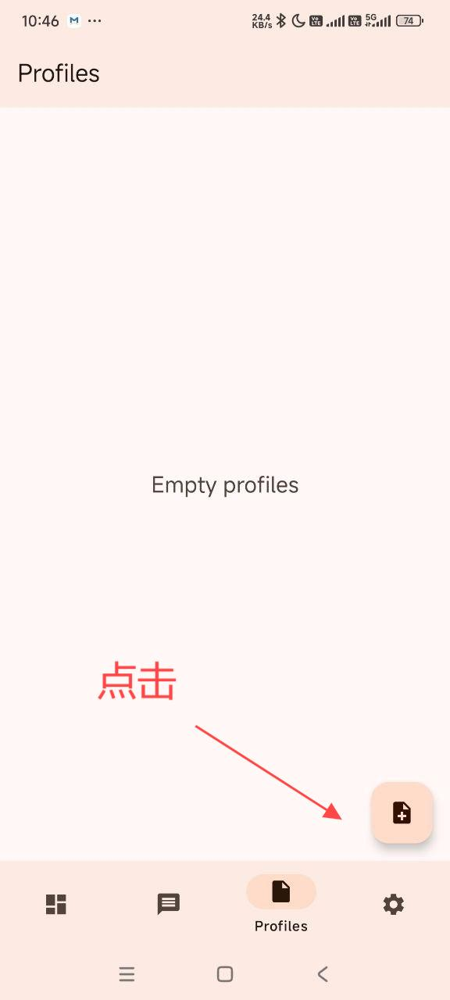
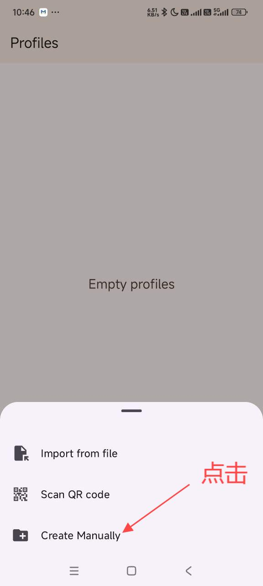
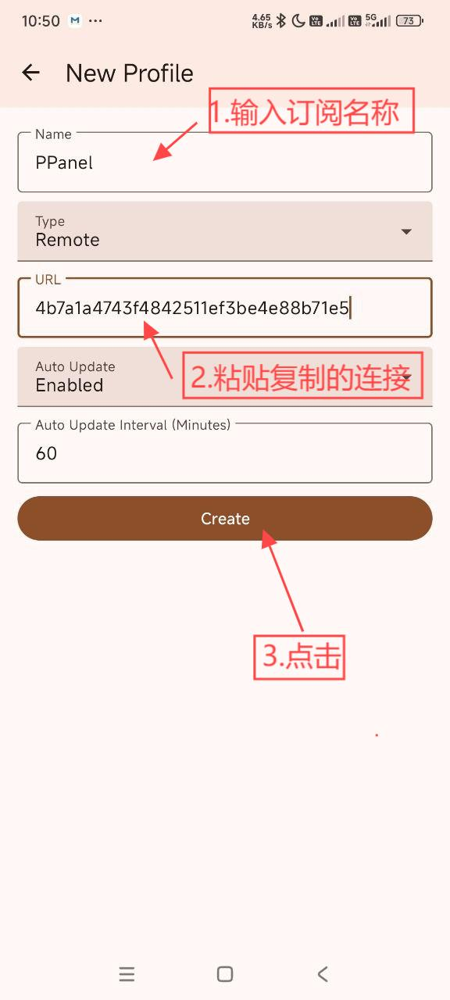
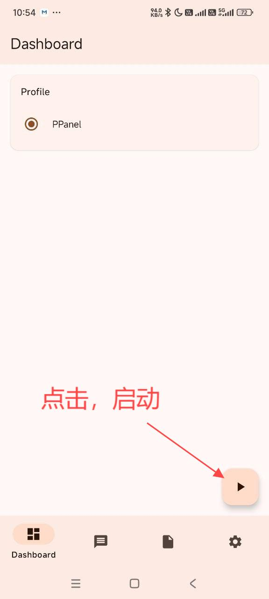
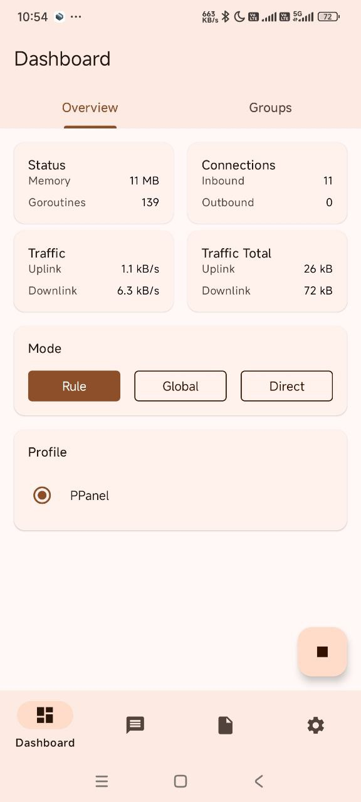

# Singbox

[Singbox](https://github.com/SagerNet/sing-box/releases/download/v1.10.1/SFA-1.10.1-universal.apk)，它是一个新的通用跨平台代理软件客户端，拥有更多新特性，并且是目前少有同时支持 iOS 和 Apple TV 并且免费的代理应用，支持 Shadowsocks 、 Vmess 、 Trojan 、 Hysteria 2 等协议。

---
**注意**：

- `系统要求：Android 5.0 及以上`
- `设备要求：Android Phone / Tablet`
---

### 使用教程：
##### 导入配置

---

最新更新于 2024.11.16
