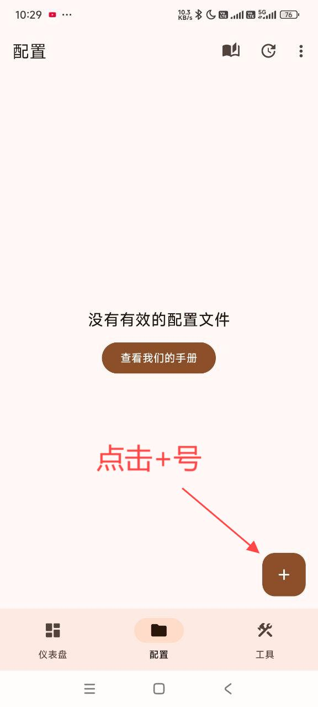
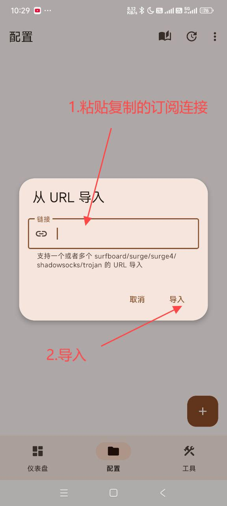
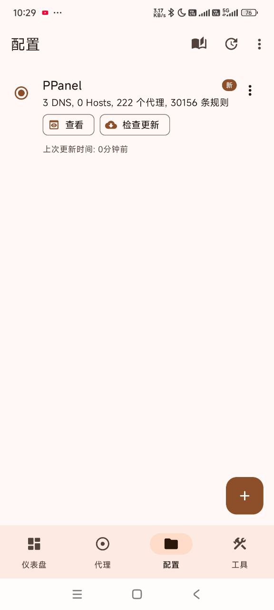
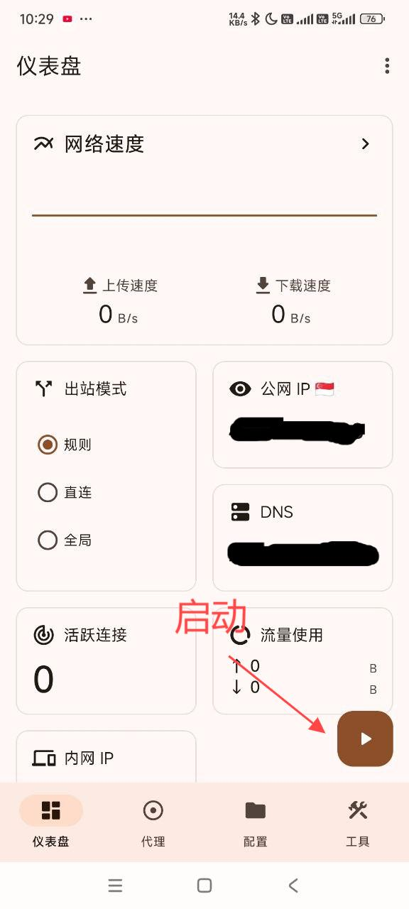
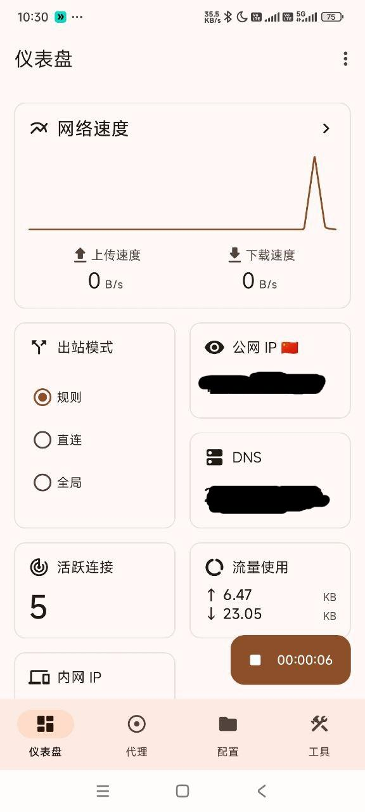

# Surfboard

[surfboard](https://tagcloud.lanzoui.com/ifnU10daxxte)，是一个性能优秀，界面美观的安卓代理工具，同时兼容 Surge 配置。支持多种代理协议，如 Shadowsocks(SS)、V2Ray(VMess)、Trojan、HTTP、HTTPS、SOCK5、SOCKS5 over TLS 等代理协议

---
**注意**：

- `系统要求：Android 9.0 及以上`
- `设备要求：Android Phone / Tablet`
---

### 使用教程：
##### 导入配置

---

最新更新于 2024.11.16
