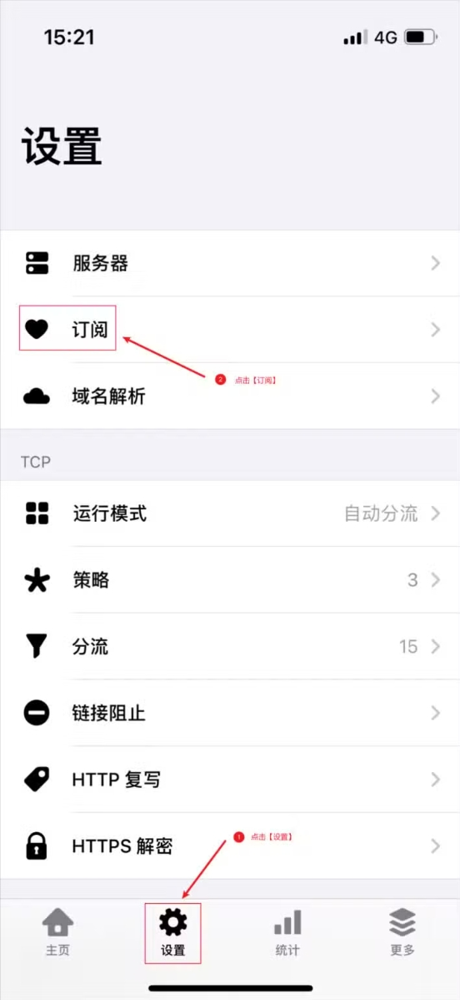
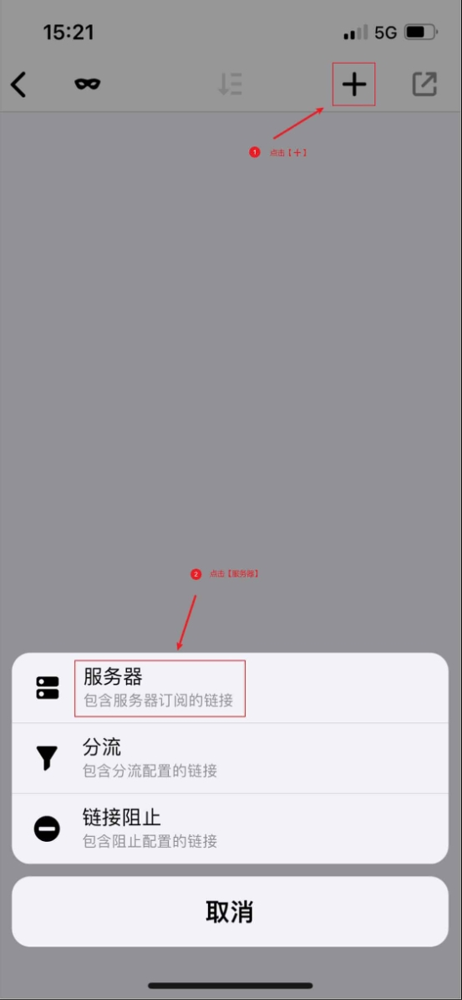
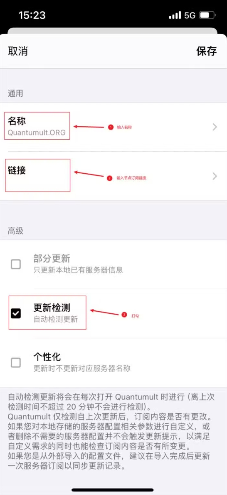
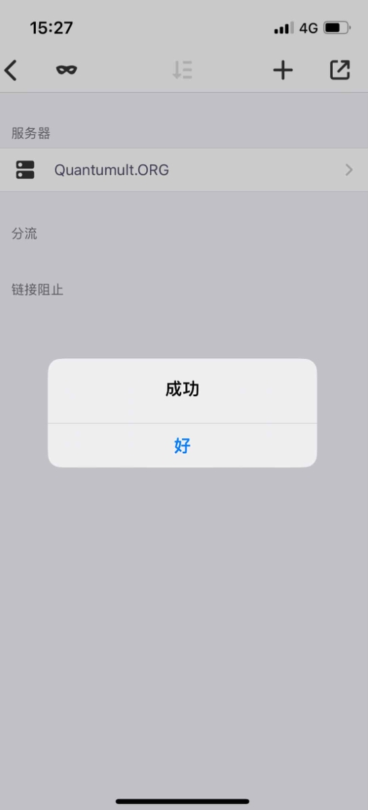
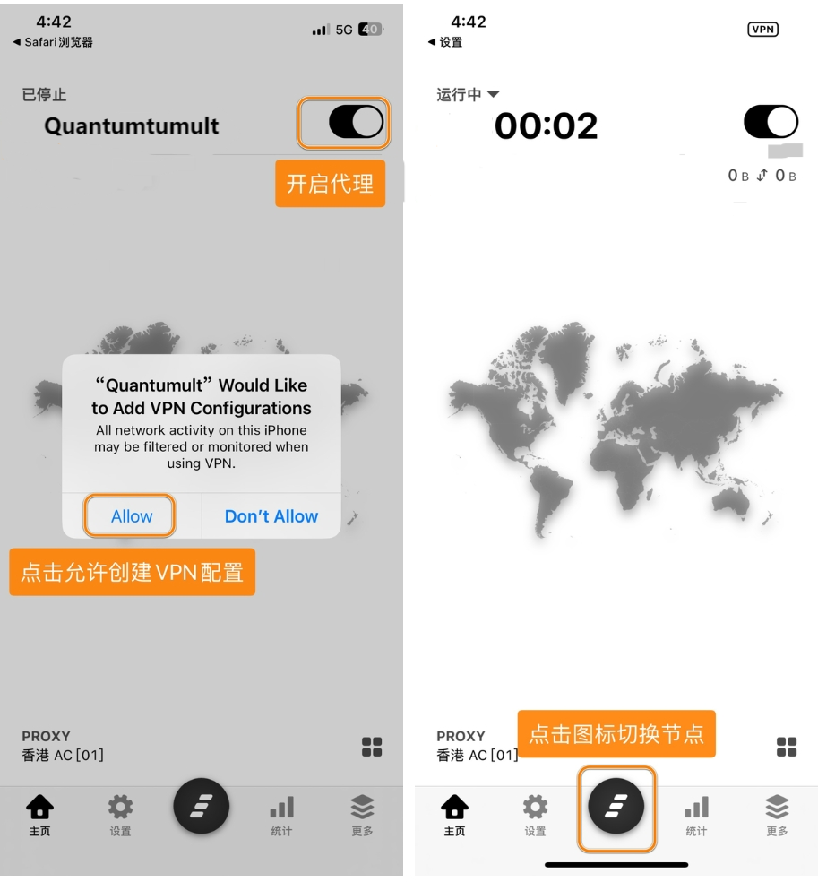

# Quantumult

[Quantumult](https://apps.apple.com/us/app/quantumult/id1252015438)，是iOS系统及macOS系统下的代理软件客户端，功能强大且支持多种代理协议，如Shadowsocks、ShadowsocksR、HTTP、Socks5、VMess、Trojan等代理协议。

---
**注意**：

- `系统要求：iOS 9.0 及以上`
- `设备要求：iPhone / iPad`
> ⚠️ 注意：
>
> 此应用已在中国大陆AppStore下架，请自行准备非中国大陆 Apple ID 下载
---

### 使用教程：
##### 导入配置

---
最新更新于 2024.11.17
