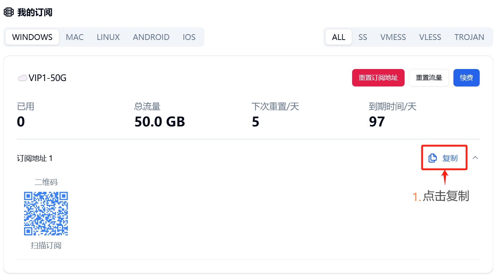
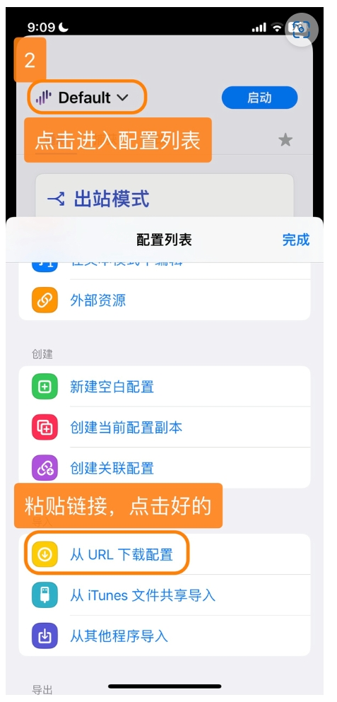
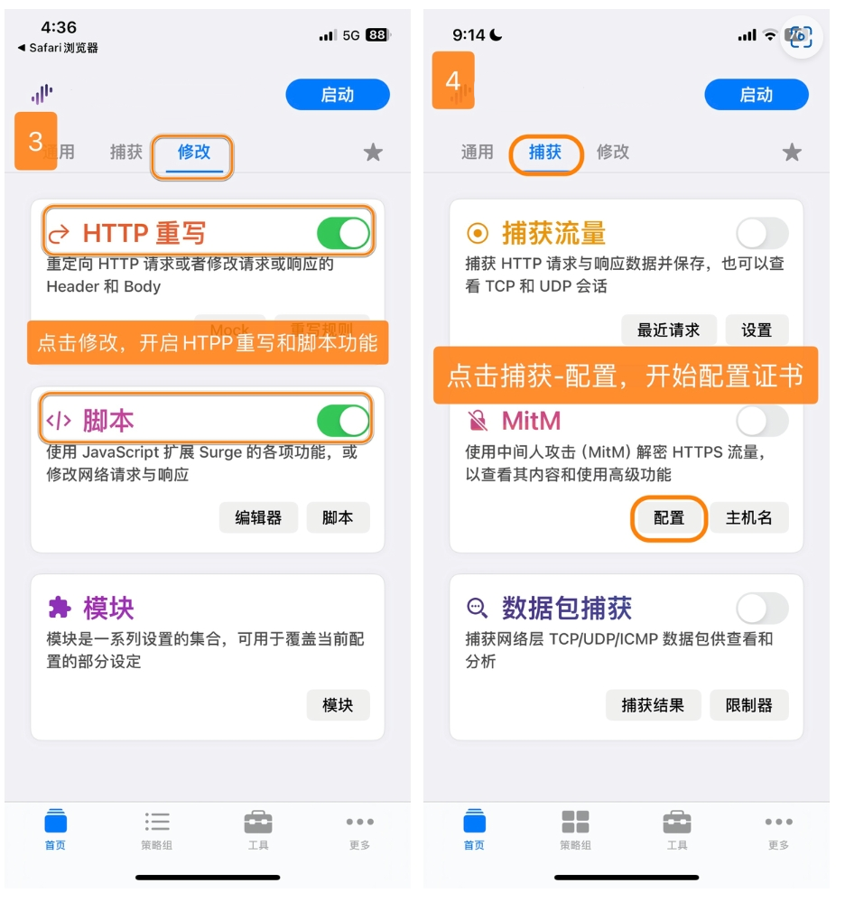
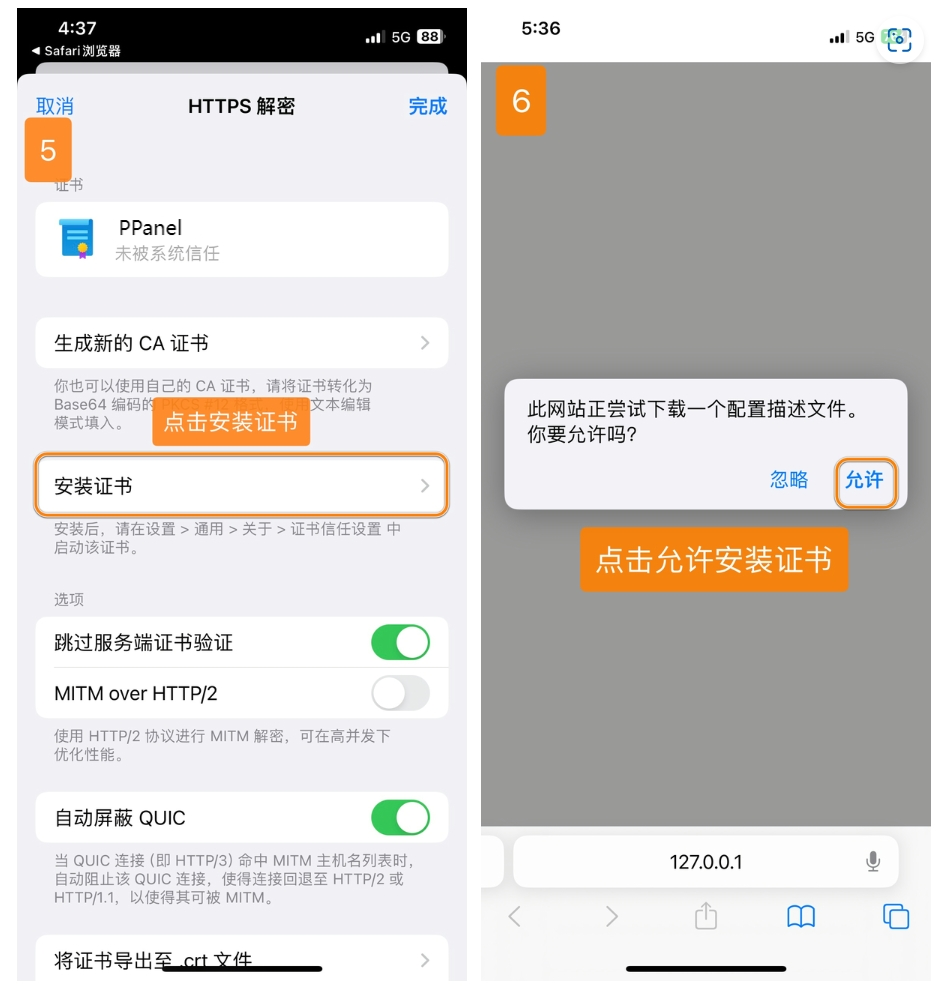
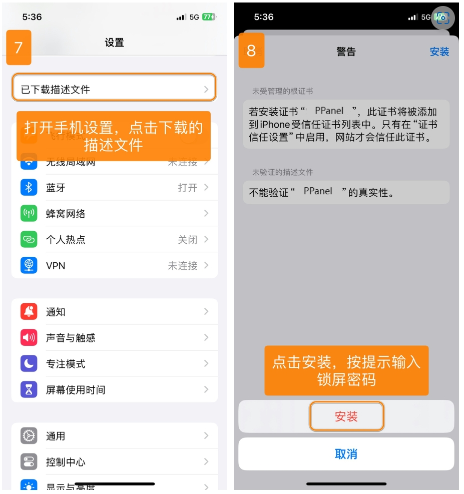
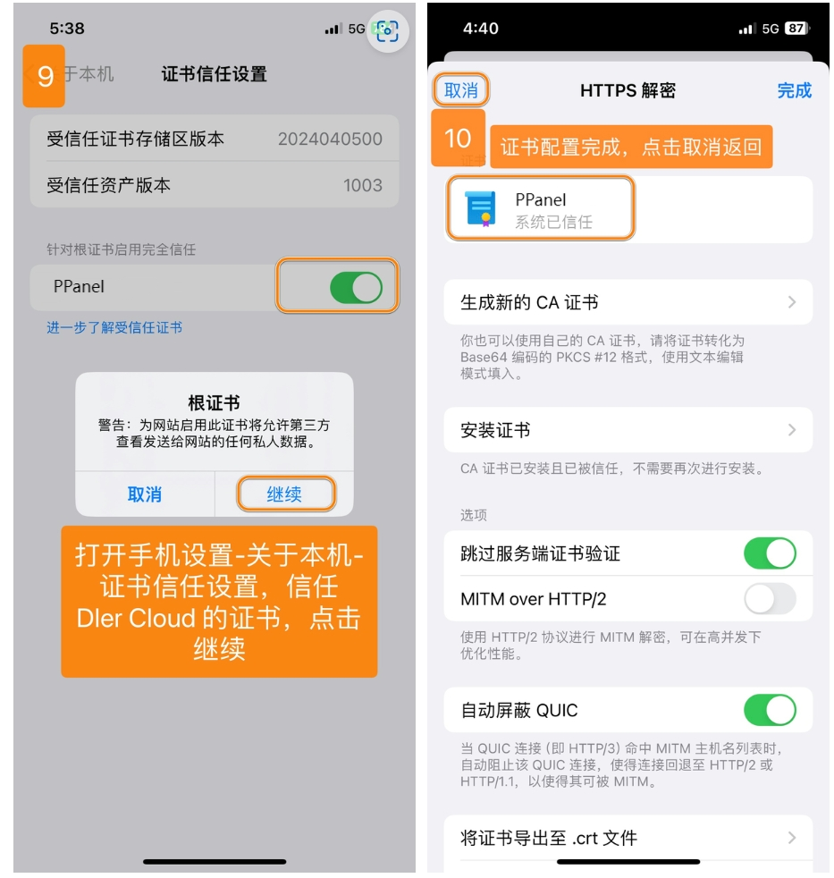
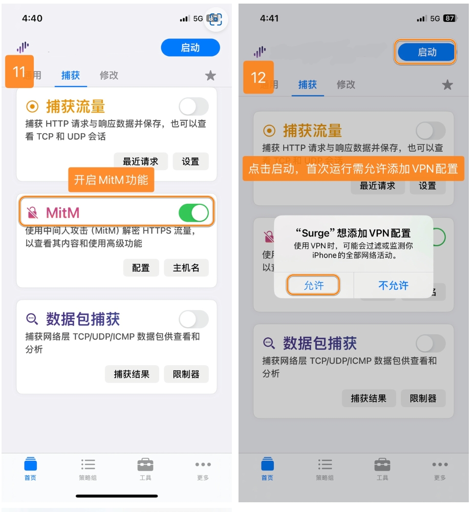
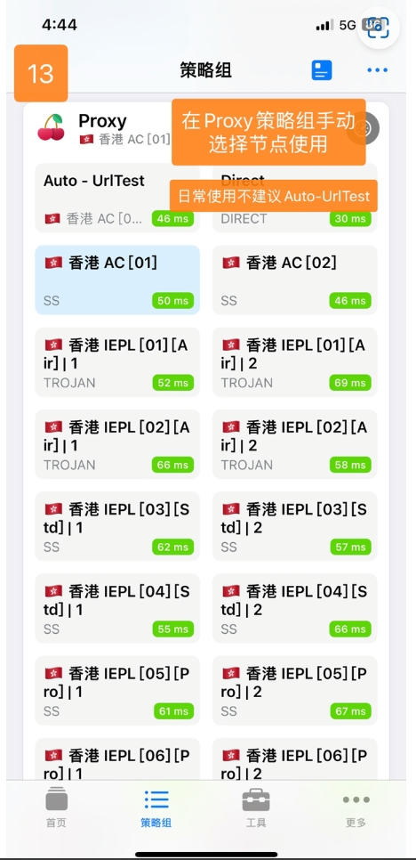

# surge

[surge](https://apps.apple.com/us/app/surge-5/id1442620678)，是一个性能优秀的iOS代理工具。支持多种代理协议，如 Shadowsocks(SS)、V2Ray(VMess)、Trojan、HTTP、HTTPS、SOCK5、Snell、SOCKS5 over TLS 等代理协议

---
**注意**：

- `系统要求：iOS 9.0 及以上`
- `软件版本：surge 2 / 3 / 4 / 5`
- `设备要求：iPhone / iPad`
> ⚠️ 注意：
>
> 此应用已在中国大陆AppStore下架，请自行准备非中国大陆 Apple ID 下载
>
>surge不兼容SSR协议
---

### 使用教程：
##### 导入配置

---
##### 更新配置

---
最新更新于 2024.11.17
