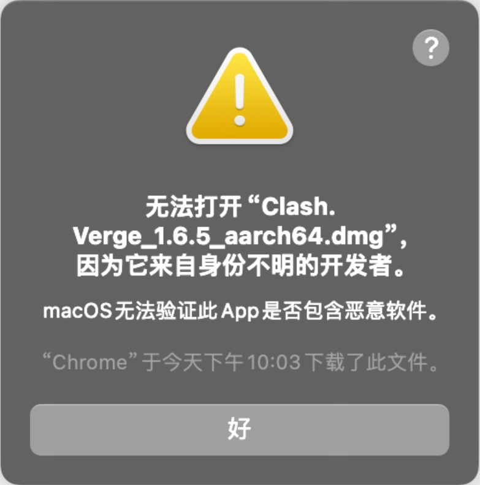
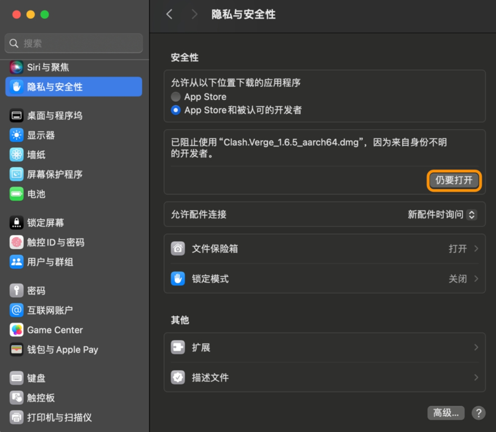
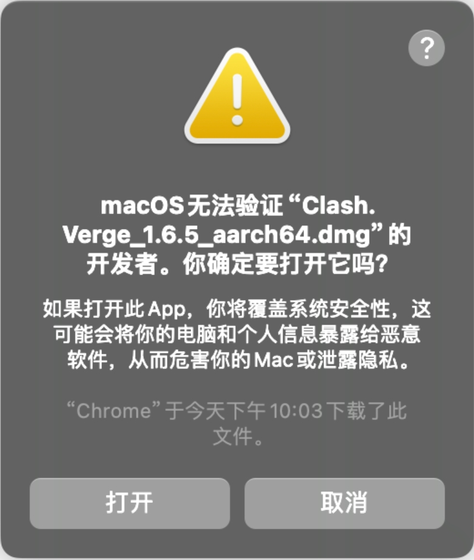
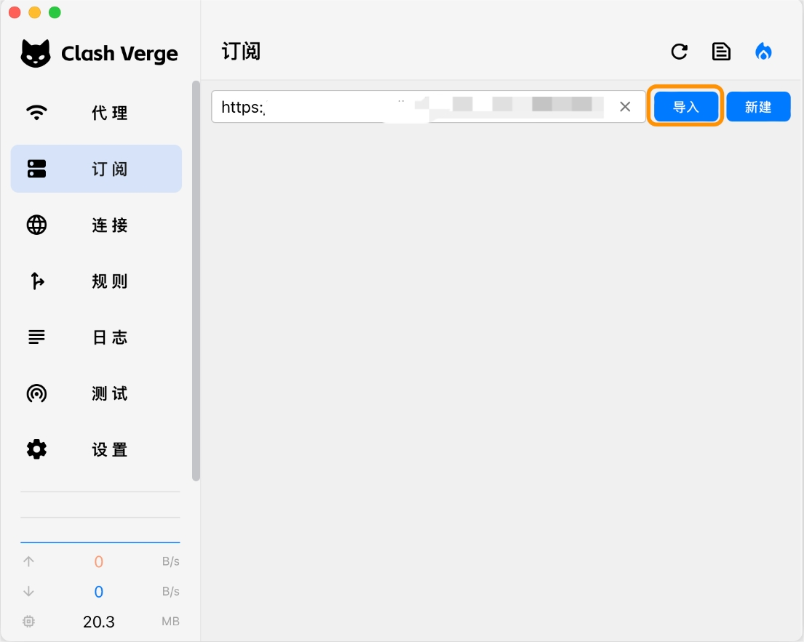
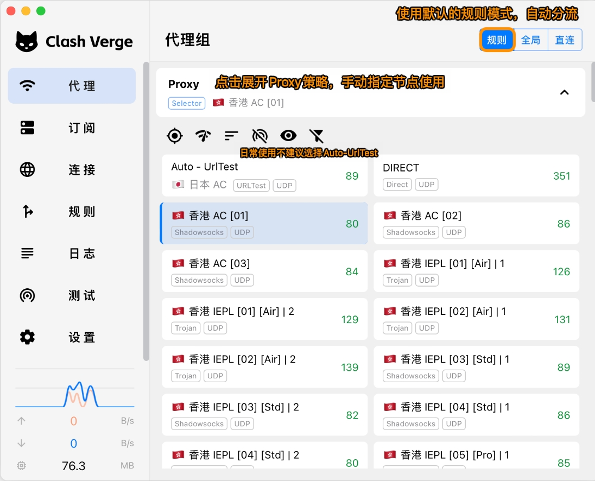
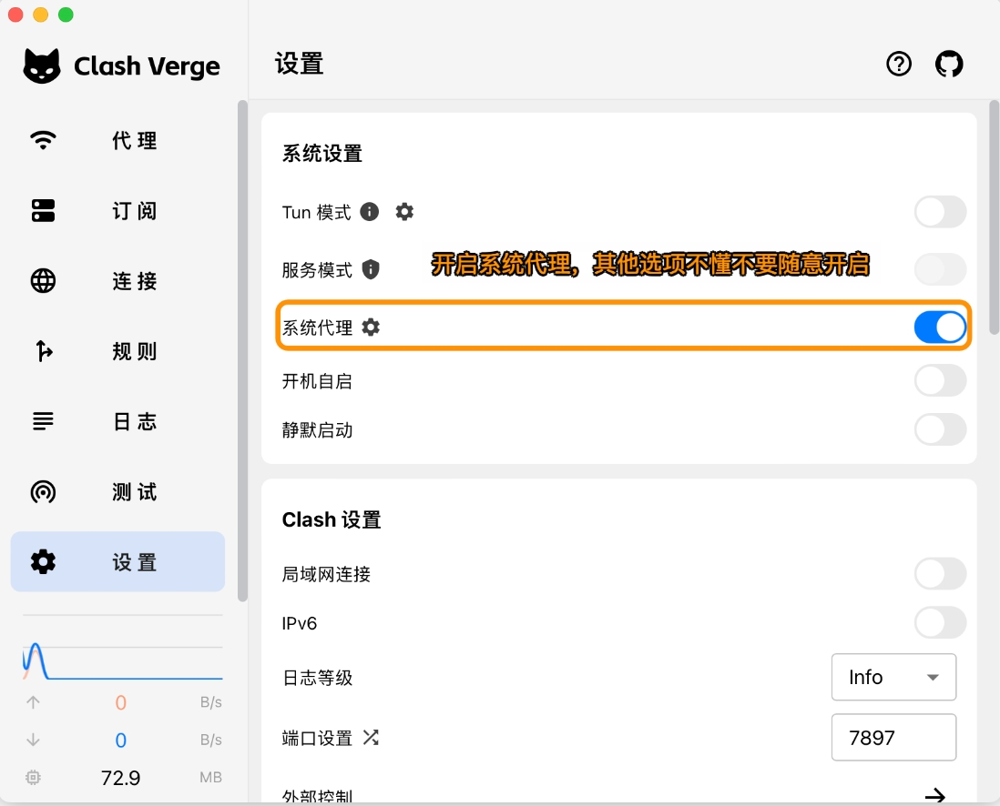

# Clash Verge

[Clash Verge](https://github.com/clash-verge-rev/clash-verge-rev/releases/download/v1.7.7/Clash.Verge_1.7.7_aarch64.dmg)，是代理工具Clash内核的GUI图形客户端，支持Windows、Linux、macOS系统，分流规则功能强大且支持多种代理协议。
---
**注意**：

- `系统要求：macOS 10.5及以上`
- `软件版本：Clash Verge for macOS`
- `设备要求：MacBook / iMac / Mac Pro`
> ⚠️ 开发者无法验证或应用已损坏
>
> 在 macOS 10.15 发布后，苹果进一步提升了系统的安全性，加强了软件的安全性验证过程。这导致许多用户在升级后，发现部分第三方软件无法打开，并收到诸如“XXX已损坏，无法打开”或“无法验证开发者”等提示，请按提示操作

---

### 使用教程：
##### 导入配置

---
##### 更新配置

---
最新更新于 2024.11.17
