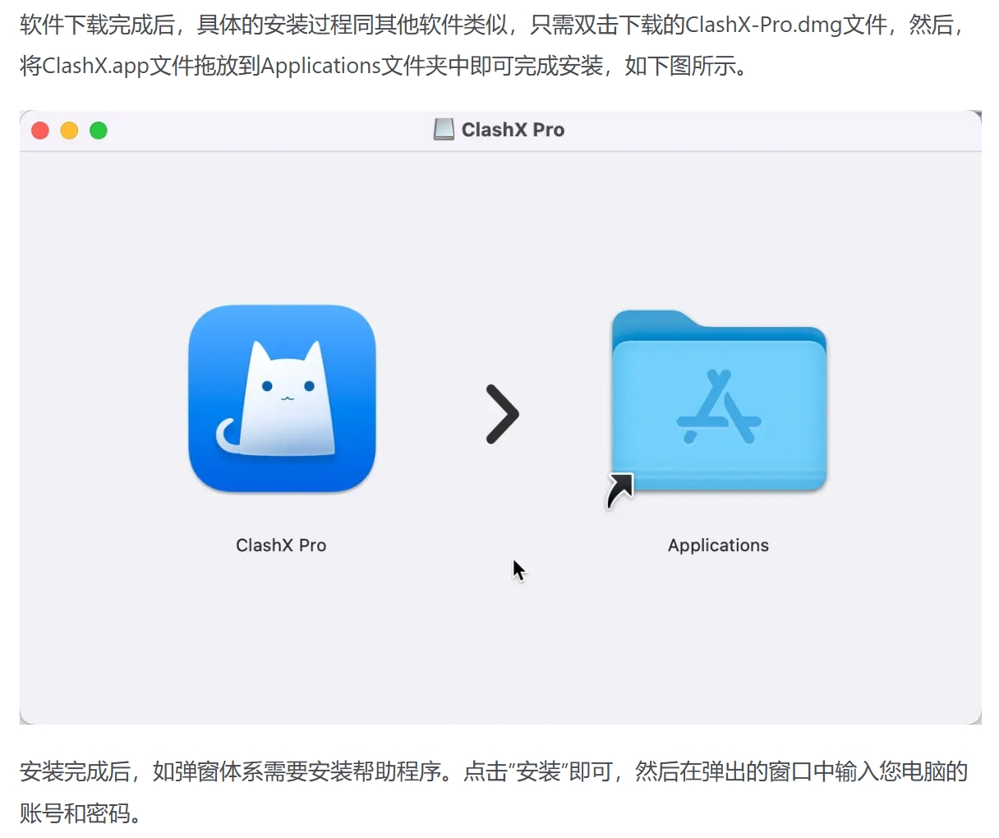
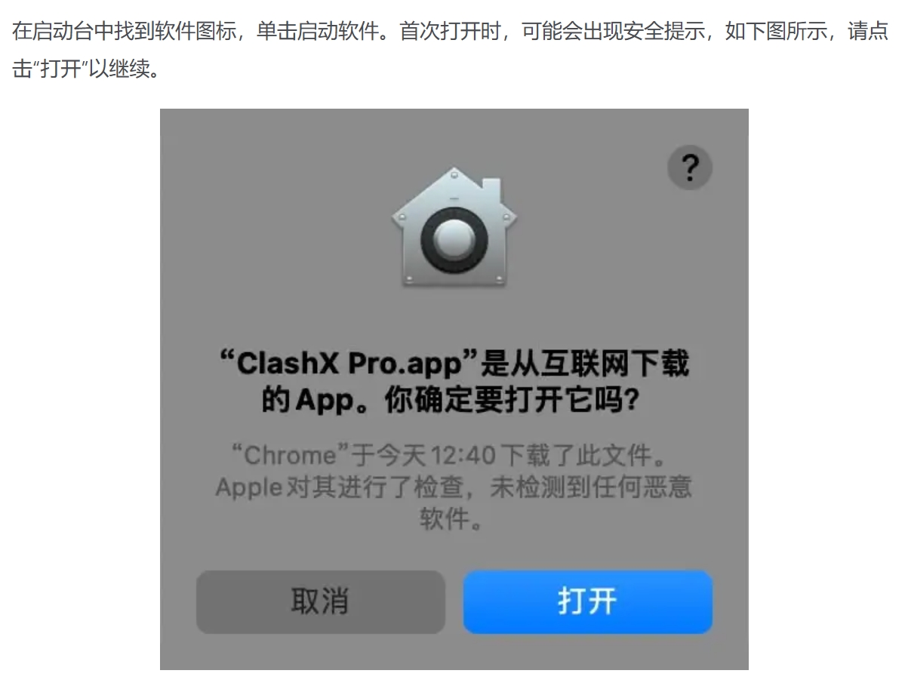
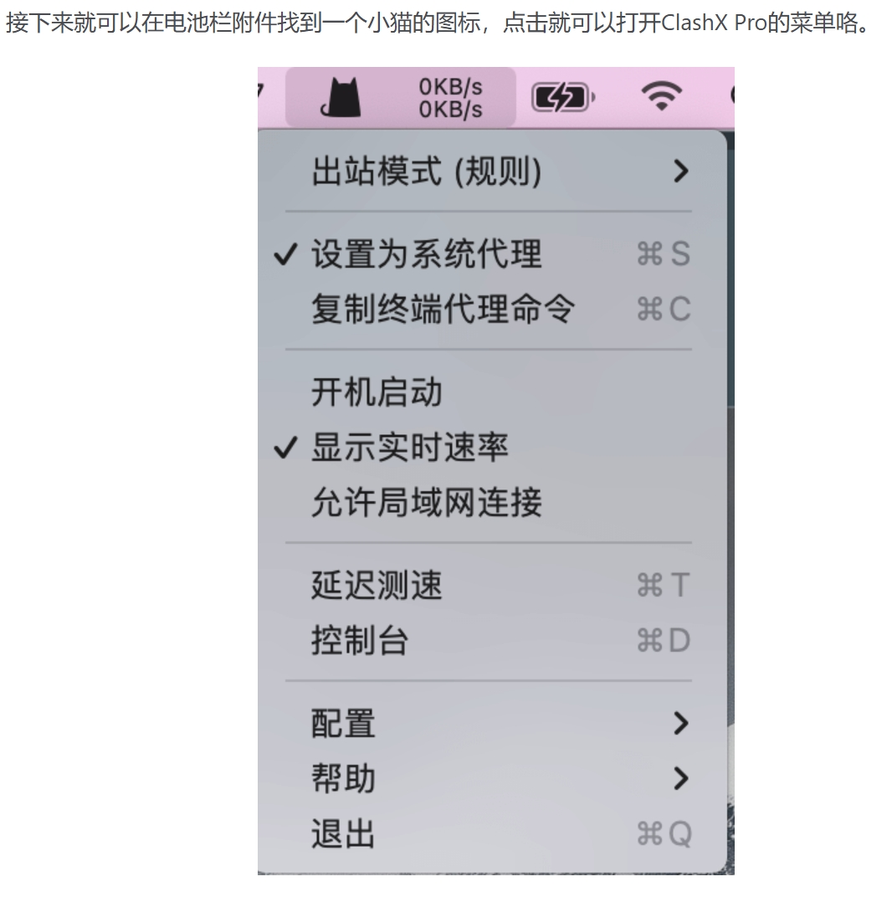
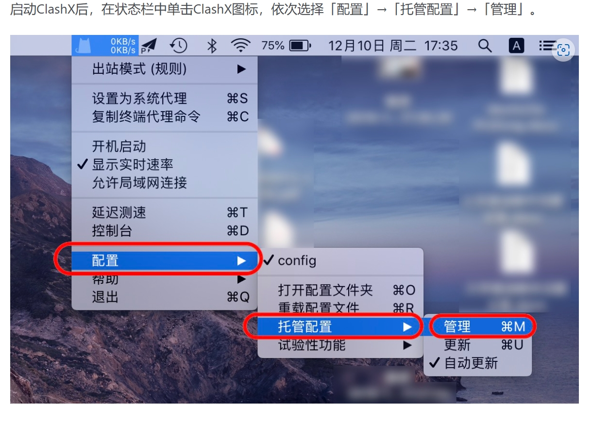
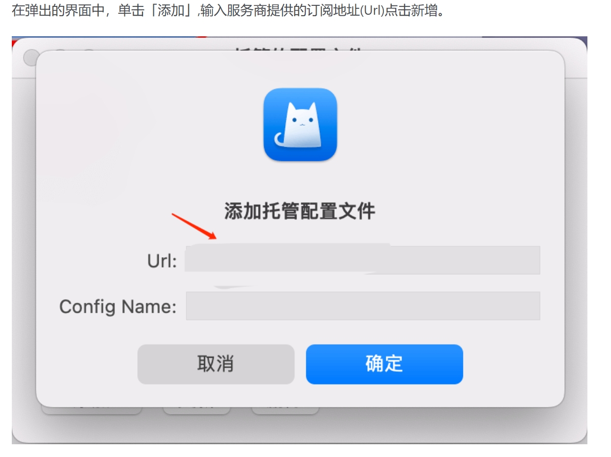
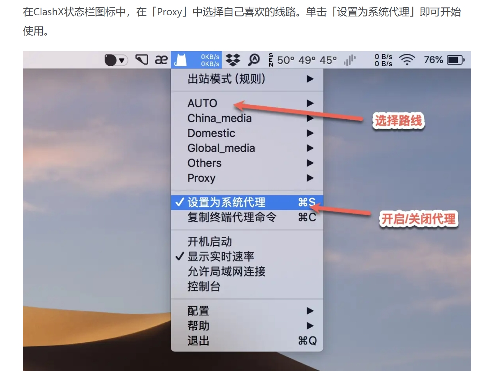

# ClashX

[ClashX](https://clashxhub.com/apps/ClashXPro.dmg)，是一个性能优秀的macOS代理工具。支持多种代理协议，如 Shadowsocks(SS)、V2Ray(VMess)、Trojan、HTTP、HTTPS、SOCK5、SOCKS5 over TLS 等代理协议
---
**注意**：

- `系统要求：macOS 10.5及以上`
- `软件版本：Clash Pro for macOS`
- `设备要求：MacBook / iMac / Mac Pro`
---

### 使用教程：
##### 软件安装

---
##### 导入配置

---

最新更新于 2024.11.17
