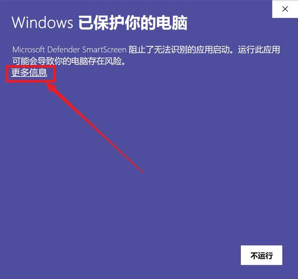
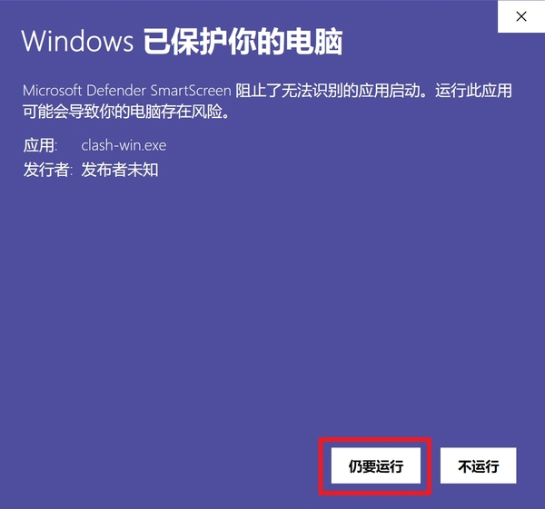
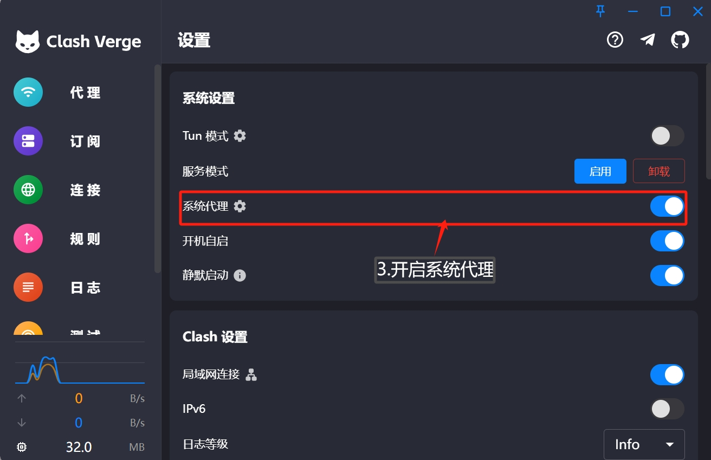
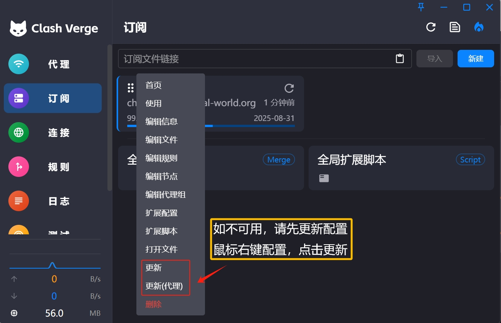

# Clash for Windows

[Clash for Windows](https://github.com/clashdownload/Clash_for_Windows/releases/download/0.20.39/Clash.for.Windows.Setup.0.20.39.exe)，Clash for Windows是代理工具Clash在Windows系统的图形客户端，同时还支持Windows、Linux、macOS三大系统，功能强大且支持多种代理协议，如Shadowsocks(SS)、ShadowsocksR(SSR)、Socks、Snell、V2Ray、Trojan等代理协议。

---
**注意**：

- `系统要求：Windows XP 及以上（64-bit）`
- `设备要求：Windows PC / Tablet`
> ⚠️ 注意：Windows 10 首次运行可能会提示被阻止，点击「更多信息」 - 「仍要运行」

---

### 使用教程：
##### 导入配置

##### 更新配置

---

最新更新于 2024.11.16

