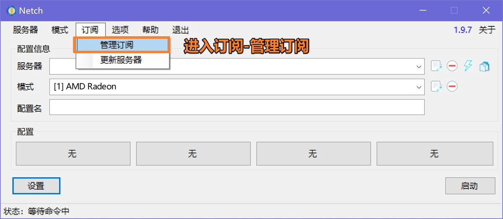
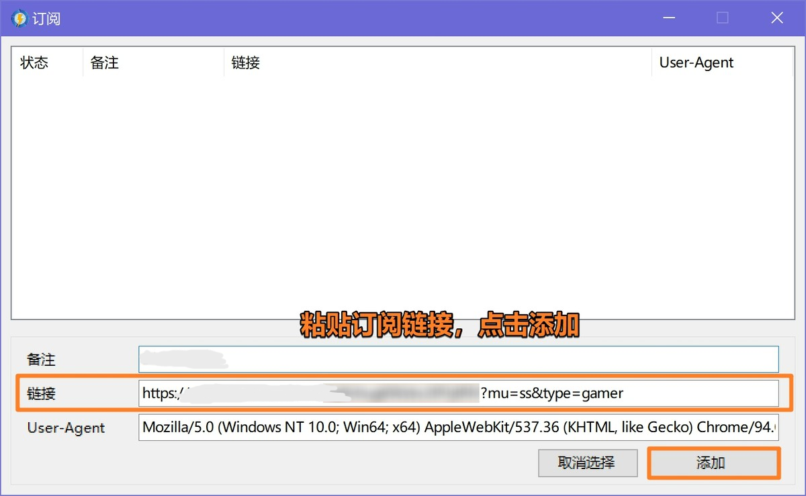
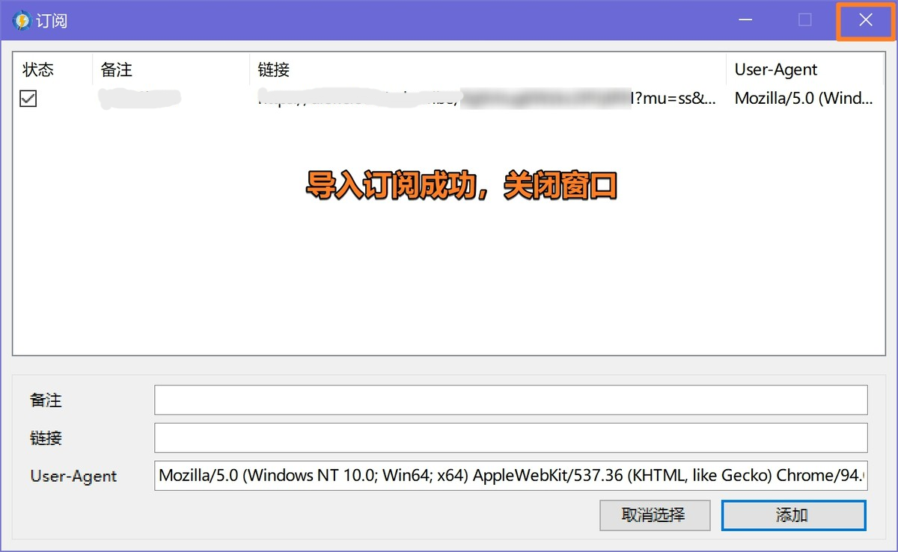
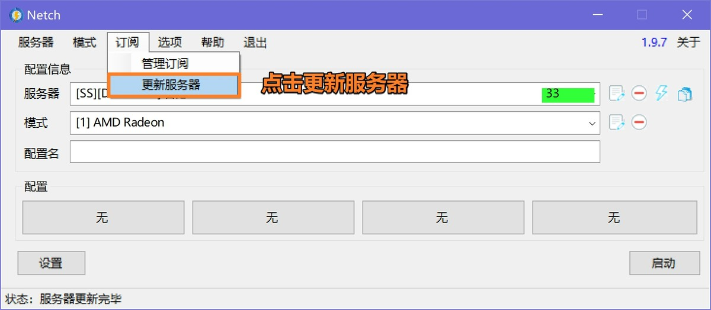
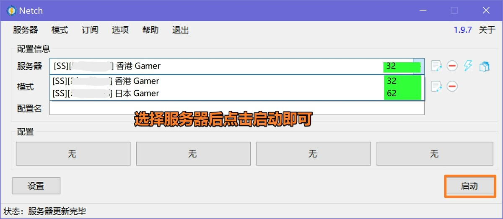

# Netch（游戏/特殊）
[Netch](https://github.com/netchx/netch/releases/download/1.9.7/Netch.7z)，Netch 是一款 Windows 平台的开源游戏加速工具，通过扫描游戏目录获得需要代理的进程名进行代理
---
**注意**：

- `系统要求：Windows 7 及以上（32/64-bit）`
- `设备要求：Windows PC / Tablet`

> ⚠️ 注意：
>
> 尽管 Netch 宣称为游戏而生，但 SS / SSR / Vmess / Trojan 项目却并非为游戏设计的，其设计结构和很多代码实现都并不能提供足够优秀的游戏性能。我们仍然建议有游戏加速需求的用户使用专业的游戏加速器。
>
> 此外，如果你有使用 BitTorrent 协议的需求（各类 BT/PT 下载），则应当避免在使用这些软件时开启 Netch，否则 BitTorrent 流量将有极大可能被 Netch 路由通过 机场 网络。而 部分机场 的条款和条件中明确指出不允许在其网络上使用 BitTorrent 协议，否则将暂时或永久限制订阅或账户访问。
---

---
> ⚠️ 模式均为软件内置，配置文件请自行设置

最新更新于 2024.11.16
